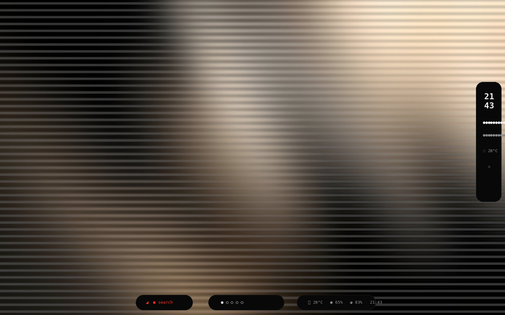
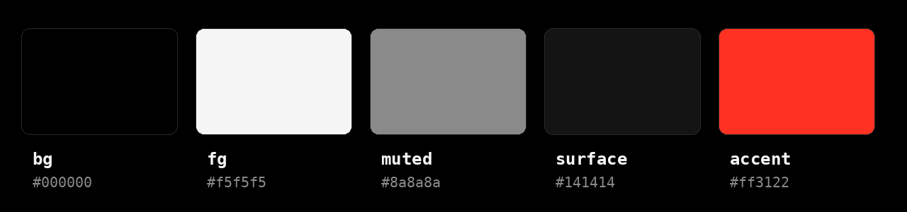

# navairgap's dots

hyprland rice. nothing os inspired — black, white, one red, dots everywhere.



wallpaper is generated by scripts/make-wallpaper.sh, dots and all.

## install

```bash
git clone https://github.com/navairgap/dotfiles ~/dotfiles
cd ~/dotfiles
./scripts/install.sh
```

arch only. installs the packages, backs up your old ~/.config to
~/.config/backup-<date>, symlinks everything, generates the wallpaper.
log out, pick hyprland at your dm, log in.

## keys

| key | what |
| --- | --- |
| super + t | kitty |
| super + r | rofi |
| super + b | firefox |
| super + e | thunar |
| super + q | close |
| super + f | fullscreen |
| super + m | maximize |
| super + arrows | focus |
| super + shift + arrows | move window |
| super + 1..5 / shift+1..5 | workspace / send window |
| super + drag | move window |
| super + right-drag | resize |
| fn volume / brightness | wpctl / brightnessctl |
| super + shift + r | hyprctl reload |

## what's here

hypr/ (main, keys, autostart, rules, colors) · waybar (pill bar + widgets) ·
rofi · kitty · dunst · fastfetch · nothing wallpapers · gtk dark · screenshot helper

## palette



bg `#000000` · fg `#f5f5f5` · muted `#8a8a8a` · surface `#141414` · red `#ff3122`

## known issues / todo

- waybar tray sometimes doesn't come up on first boot. `pkill waybar && waybar &` fixes it. haven't debugged further.
- swww loses the wallpaper after suspend sometimes — just re-run `scripts/make-wallpaper.sh`, it's idempotent.
- bluetooth + pipewire crackle on some headsets. it's pipewire, not the dots. probably.
- screenshots: `scripts/screenshot.sh` (area select, auto-copies) or plain `grim`.
- right-side dot widgets (the NThing look): `waybar -c ~/.config/waybar/widgets.jsonc -s ~/.config/waybar/style.css`. optional, the pill bar is the default.
- todo: steal a better rofi theme. todo: decide if i actually like the gaps_out=10 or if 8 is the truth.
- todo: nvidia laptop owners — set your env vars, you're on your own.

## borrowed from

- keybind layout and the general shape: prasanthrangan/hyprdots
- blur/animation starting point: end-4 — then i made them boring on purpose
- dot workspaces — half of r/unixporn does this, not sure who started it
- wallpapers + JND dot fonts: Runixe786/NThing-UI (rainmeter skin) — personal-use only, go star the original
- reference look: nothing.community "NothingOS inspired desktop setup" thread

## license

mit (see LICENSE)

---
maintained · verified 2026-09-30
---
maintained · verified 2026-10-01
